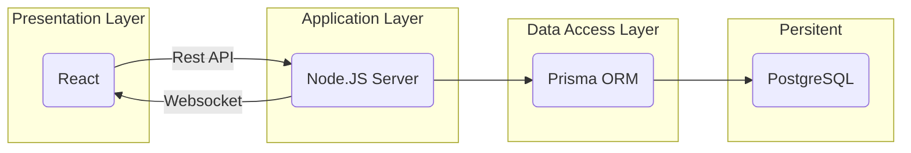

# English Auction
Demo [https://english-auction.up.railway.app/](https://english-auction.up.railway.app/)

**English Auction** is web project fully written in Typescript where users can authenticate and create multiple auctions, set the duration of the auction and the other users can bid for the given item. When the auction ends the user with highest bid wins the item.

## Getting Started
### System Requirements
1. Node.JS ^18.0.0
2. PostgreSQL

### Running Development
1. Make sure you create .env file based on .env.example
2. Provide valid `DATABASE_URL`
3. Install dependencies

```bash
npm install
```

4. Run database migration

```bash
npx prisma migrate dev
npx prisma generate
```

5. Run development server

```bash
npm run dev
```

## Database Diagram

</img>

## System Architecture



The **Auction System** using client-server architecture where the system divided into 2 main components:
1. Client (React) for giving user interface and handling user inputs
2. Server (Node) for handling business process and storing data into the database.

### Communication
1. Rest API

The server provided a list of endpoint that corresponds to each functionality, get list of auction, create an auction, bid an auction, and authentication.


2. Websocket

The websocket used to distribute mutation event on the auction like bid event, publish event, and when some auction ended so the user can keep up with the auction without having to refresh and making request burst to the backend.

### Authentication
The **Auction System** uses basic authentication email/password with JWT that stored on cookie with httpOnly attribute and per token will be expired in 12 hours.

by using this approach the user will have good experience because they doesn't need to reloggin after thay close browser session unless they reached 12 hours.

because the JWT is completely stateless and the token have relatively long lifetime, then if the token compromised, the attacker will have much time to do their stuff. the only whay to stop this is changing the jwt secret on the backend and all users need to reloggin.

### Scaling
Currently, the only scale scenario that makes sense for this system is by vertical scaling. If we insist to scale it horizontally, the system and transaction will just works fine except for the websocket.

### Further Improvement
Currently for handling bidding race condition it only rely on database lock, so at certain point when a lot of users bidding an auction at the same time, some of then may experience timeout. to tackle that issue I think we need to implement queueing.

## Tech Stack Overview
- Next.js

Both Backend and Frontend stuff implemented in Next.js but with some adjustment that I made on the api handler so it more like express for routing and nest.js for the controller, I use typescript decorator to handle auth, request validation, and response sanitizatio.

- Prisma

For the ORM I use Prisma because it included everything that I need to speed up the development without sacrificing too much on the quality. it comes with migration, schema definition, typechecking, and raw query when needed.

- Typebox & AJV

I've been using Typebox for a long time and I really love it because it can generate both json schema and typescript type. the json schema uses for request & response validation on the backend side and used to validate form validation on the client side.
